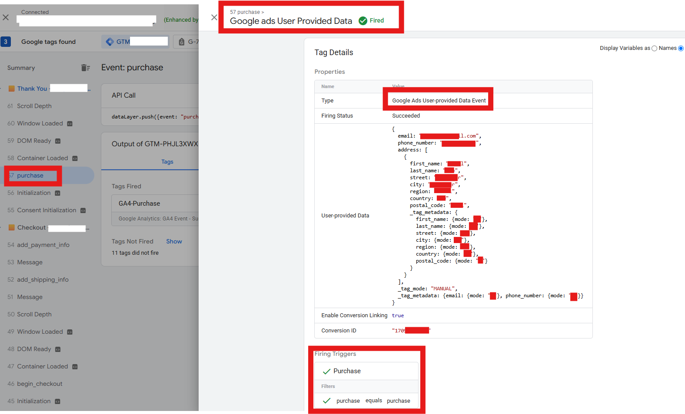
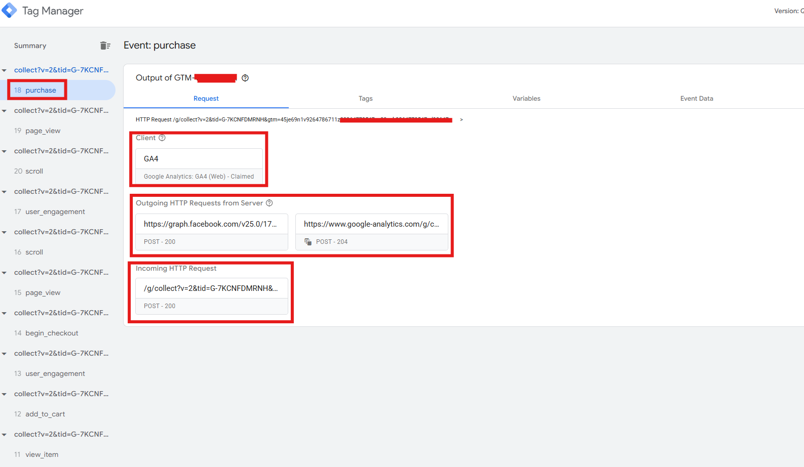
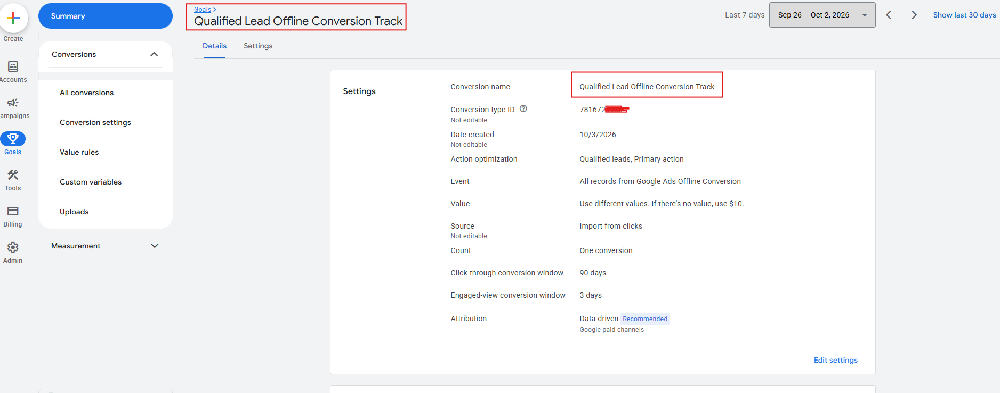
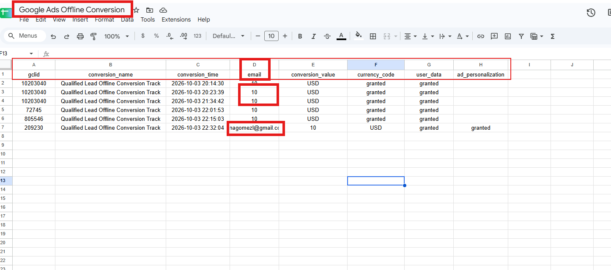
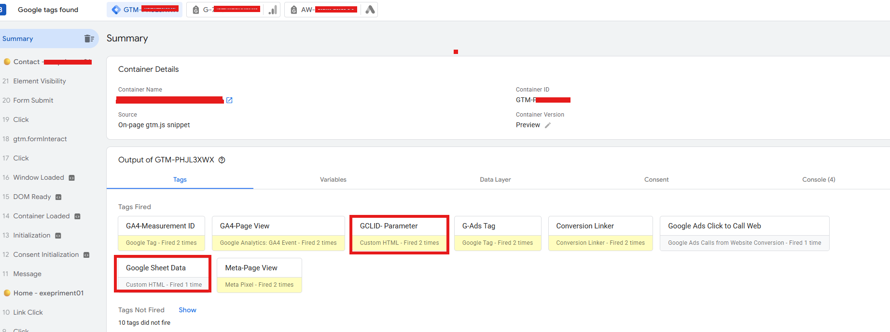
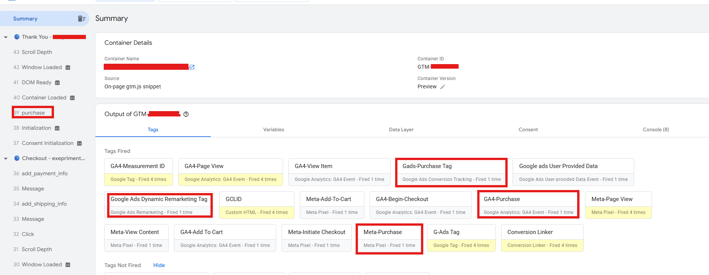
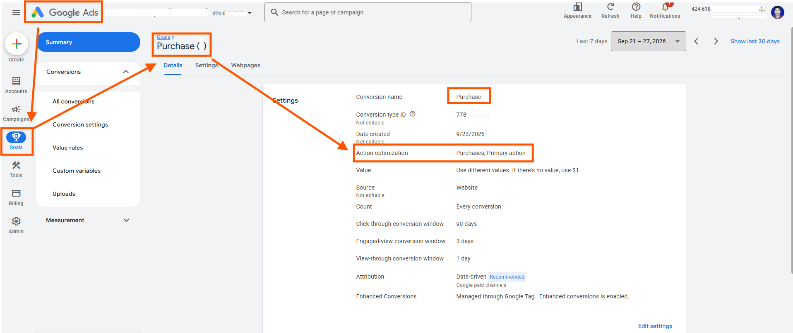
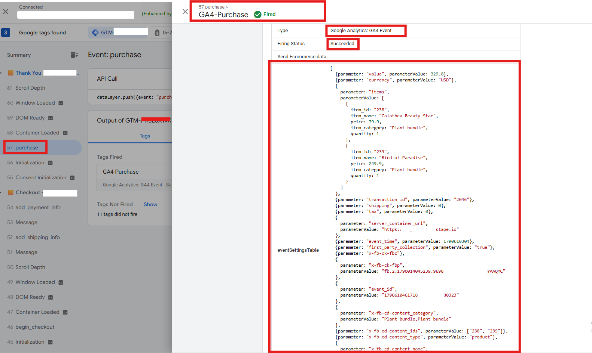

### Hi there, 👋 I'm Semul Deb Nath

🔭 I’m currently specializing in Advanced Web Analytics, Server-Side Tracking, and Marketing Attribution.  
🌱 Currently exploring & learning: **Mixpanel, Triple Whale, and RedTrack** for advanced product analytics and multi-channel attribution.  

---

### 📫 Connect With Me

  
  
  
  
  
  

---

### 🛠️ Core Expertise & Tech Stack

---

### 🚀 Advanced Tracking & Implementation Highlights

- **Server-Side GTM & Meta Conversion API (CAPI):** Implemented server-side container via Stape.io with robust Event ID matching to successfully deduplicate browser and server events in Meta Events Manager[cite: 7, 11].
- **Enhanced Conversions & Match Quality:** Configured Google Ads User-Provided Data tags and Meta Advanced Matching to securely pass hashed PII (email, phone, address) for maximizing event match quality scores[cite: 18, 19].
- **Google Ads Offline Conversion Tracking (OCT):** Automated conversion data pipelines integrating Google Sheets with Google Ads using GCLID and user parameters[cite: 4, 5].

---

### 📸 Technical Setup Proofs & Case Studies Gallery

#### 1. Google Ads User-Provided Data Tag (Enhanced Conversions Setup)

  

#### 2. Meta CAPI Advanced Matching & Event De-duplication (Browser + Server)

  

#### 3. Server-Side GTM Request Flow (Meta & GA4 Outgoing Requests)

  

#### 4. Google Ads Offline Conversion Tracking (Qualified Lead Goal Setup)

  

#### 5. Google Sheets Data Pipeline for Offline Conversions (GCLID & User Data Integration)

  

#### 6. GTM Custom Tags & GCLID Parameter Capture Preview

  

#### 7. GTM Debug View: GA4 & Meta Purchase Tags Firing

  

#### 8. Google Ads Conversion & Primary Goal Optimization Setup

  

#### 9. GA4 Enhanced E-Commerce Purchase Payload Verification

  

---

### 📊 GitHub Stats

  

